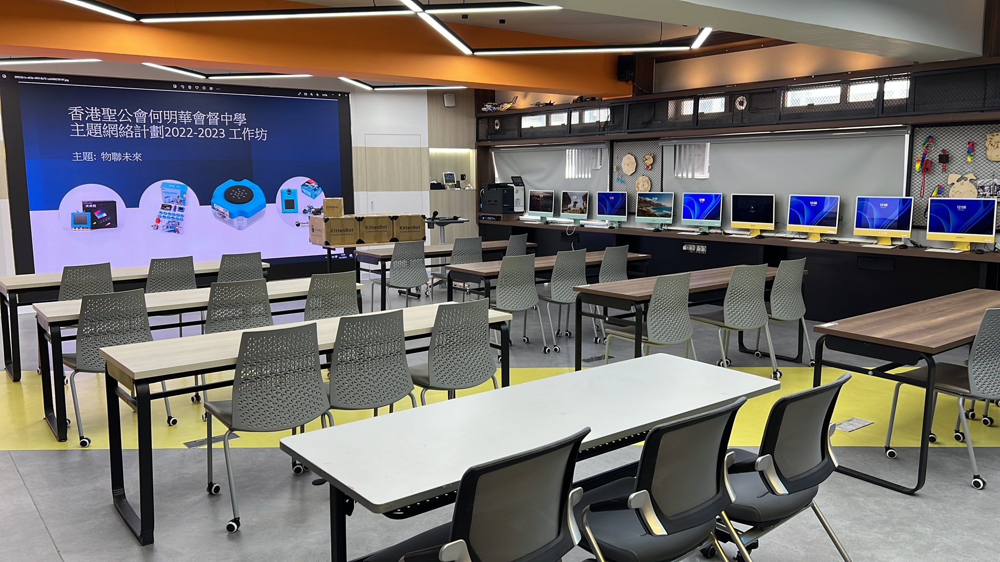

# 香港聖公會何明華會督中學-QTN優質教育基金網絡工作坊

## 資源下載

### [KittenBlock下載](https://bit.ly/060123KittenBlock)
### [PowerPoint下載](https://bit.ly/060123QTNPPT)
### [示範程式SB3下載](https://bit.ly/060123QTNSB3)
### [筆記下載](https://bit.ly/06012023Notes)
### [圖像辨識紙卡下載](https://drive.google.com/file/d/1Hr0t6ktHZWfS2o6ueOkHLQmyC9_SXwnO/view?usp=sharing)

## 其他參考資源

### [Kittenbot Sharing Hub](https://sharinghub.kittenbot.hk)

### [未來板介紹](https://kittenbothk.readthedocs.io/en/latest/futureboard/futureboard.html)

### [語音模組介紹](https://kittenbothk.readthedocs.io/en/latest/functional_module/sugar/sugar_asr.html)

### [KOI介紹](https://kittenbothk.readthedocs.io/en/latest/AI%20Cam/intro.html)

## 活動精華

