# 口罩佩戴AI*模型訓練*與*辨認* (機器學習)示範

參與者可以利用KOI 機器學習功能, 通過對KOI AI 鏡頭進行訓練, 讓KOI 在辨認模式中, 分辨出鏡頭前的人面是否有配把配戴口罩。

## KOI 機器學習的訓練與辨認概念

#### 模型訓練: 

把戴有口罩的人面影像    及  沒有配帶口罩人面的影像, 分別儲到2個分類, 並儲存到KOI 的SD card 中。

#### 辨認模式: 

KOI 會根據訓練所得的模型資訊, 判斷在鏡頭前的影像是屬於那一個分類。

## 編程平台

Microsoft MakeCode **https://makecode.microbit.org/**

#### 有用插件

Kittenbot Robotbit 擴展板 **https://github.com/KittenBot/pxt-robotbit**

Kittenbot Armourbit 擴展盒  **https://github.com/KittenBot/pxt-powerbrick**

KOI **https://github.com/KittenBot/pxt-koi**

## 編程示範與解說

### **機器學習2步曲**

1. 分類模型訓練
2. 運行分類器 - 辨認模式

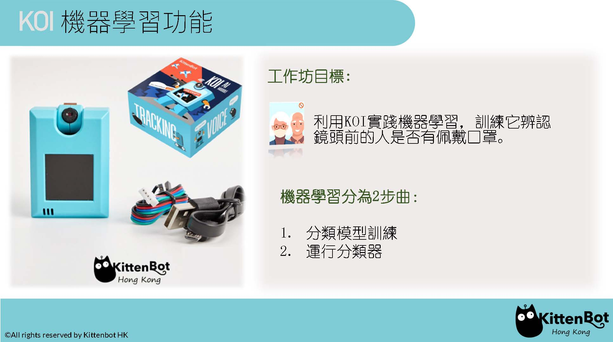

### **示範器材接線**

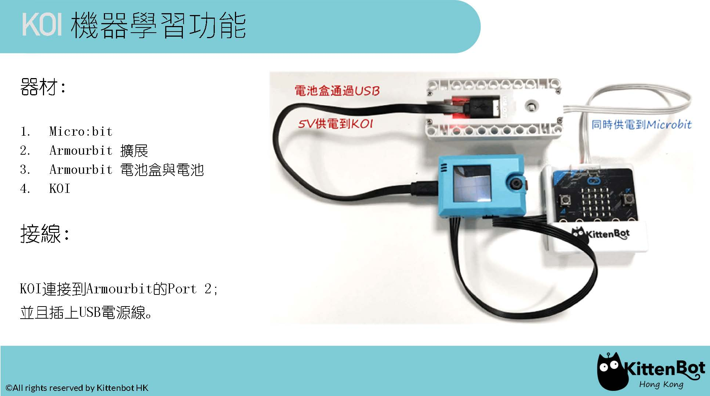

### **1. 分類模型訓練**

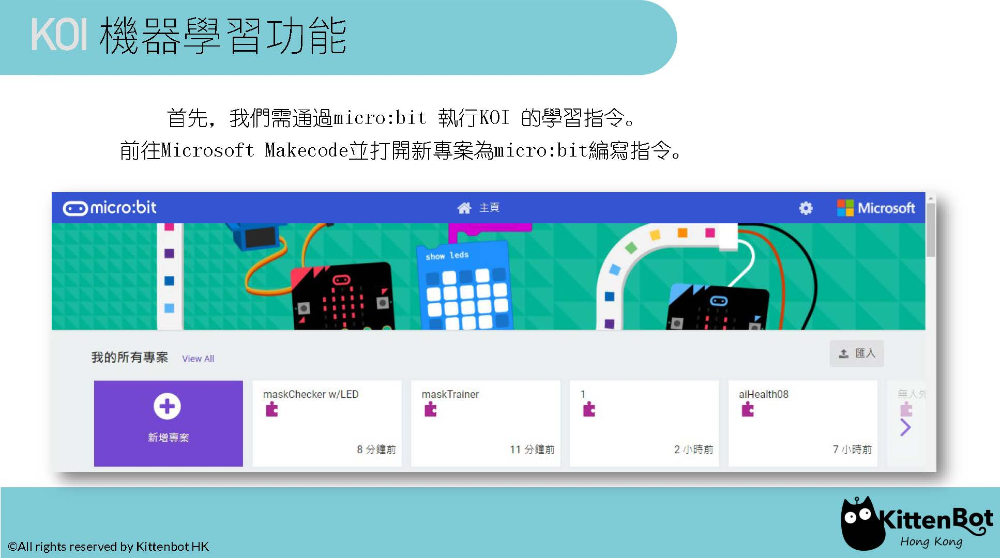

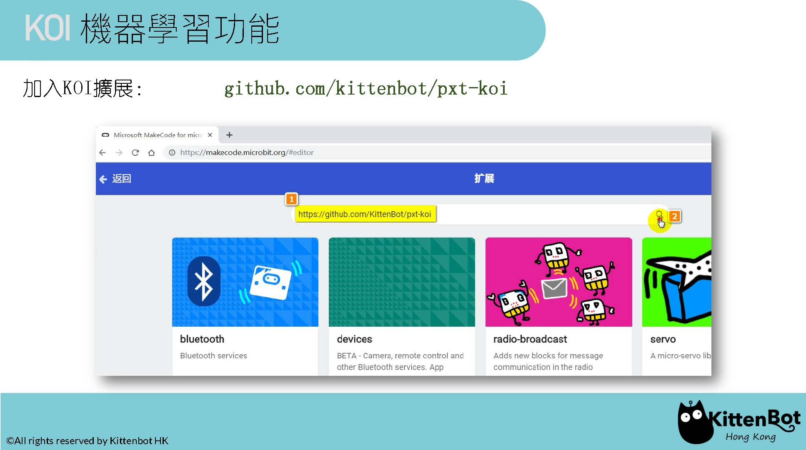

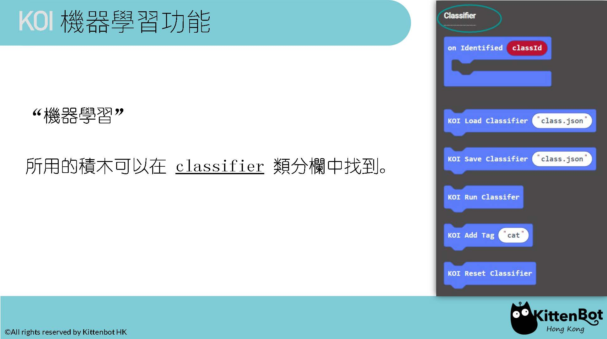

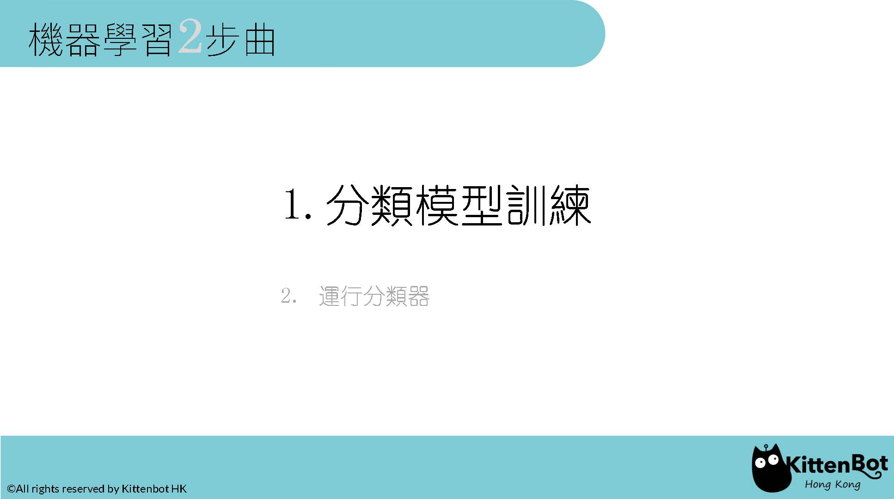

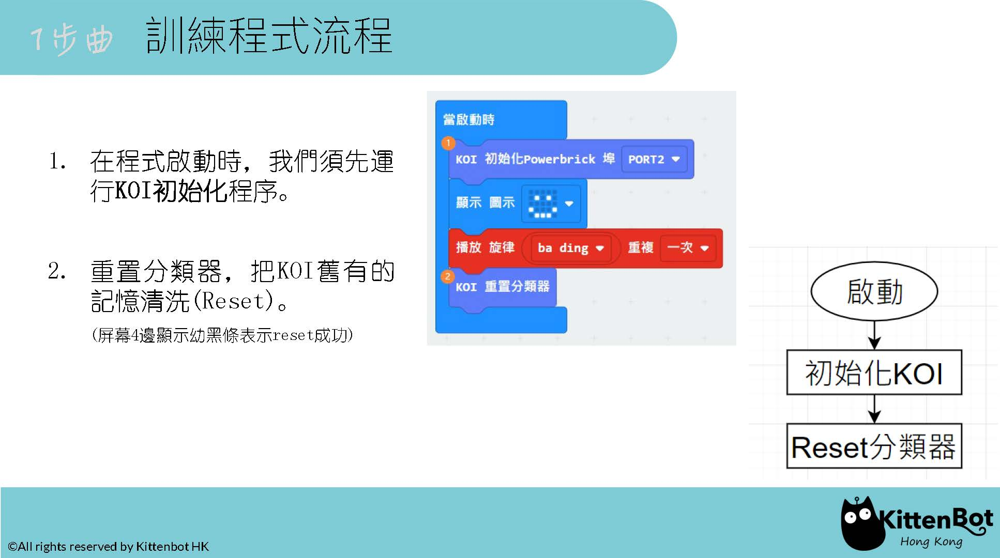

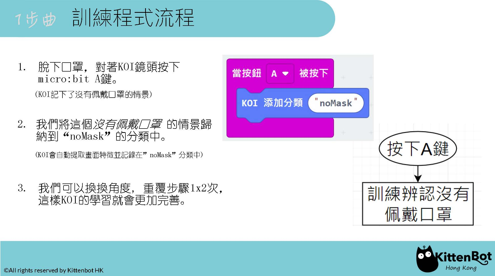

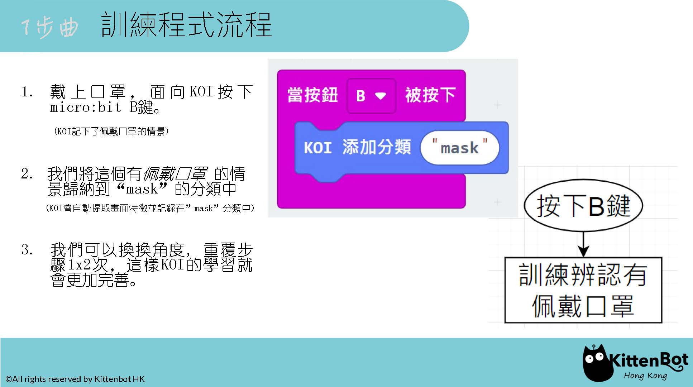

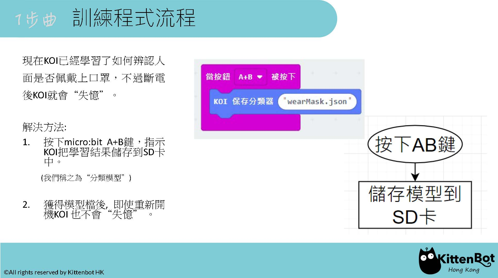

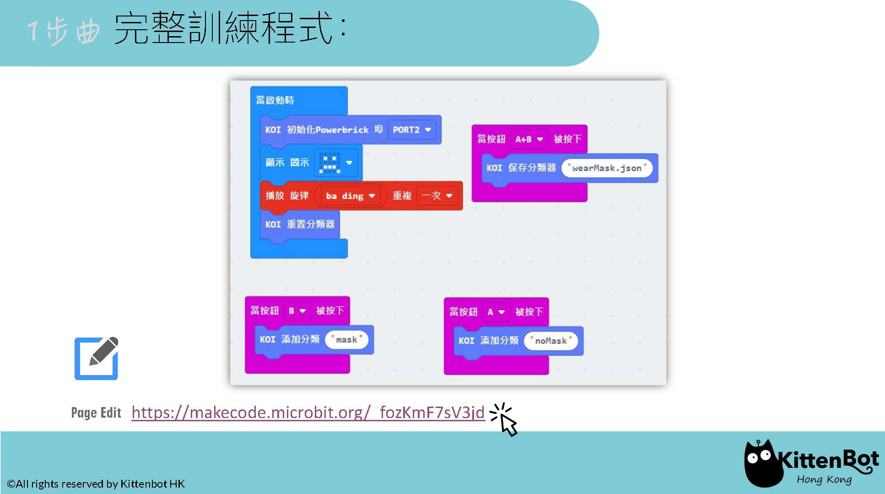

#### **訓練參考程式:  [https://makecode.microbit.org/_fozKmF7sV3jd](https://makecode.microbit.org/_fozKmF7sV3jd) **

#### **訓練示範 Youtube: [https://youtu.be/CD-KRfKVDKc](https://youtu.be/CD-KRfKVDKc)**

### 2. **運行分類器** - 辨認模式

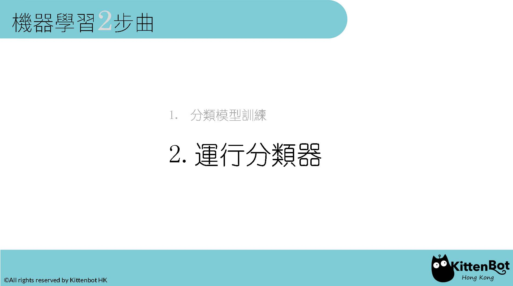

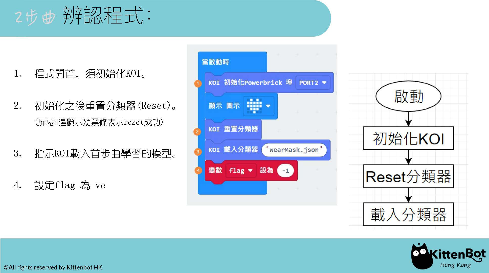

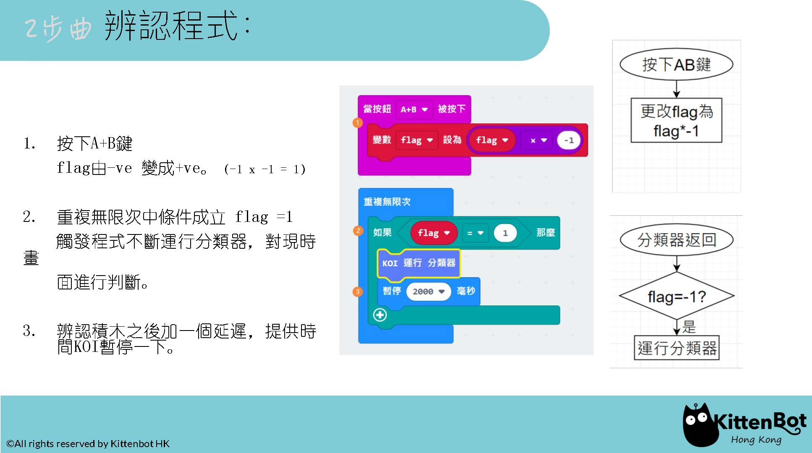

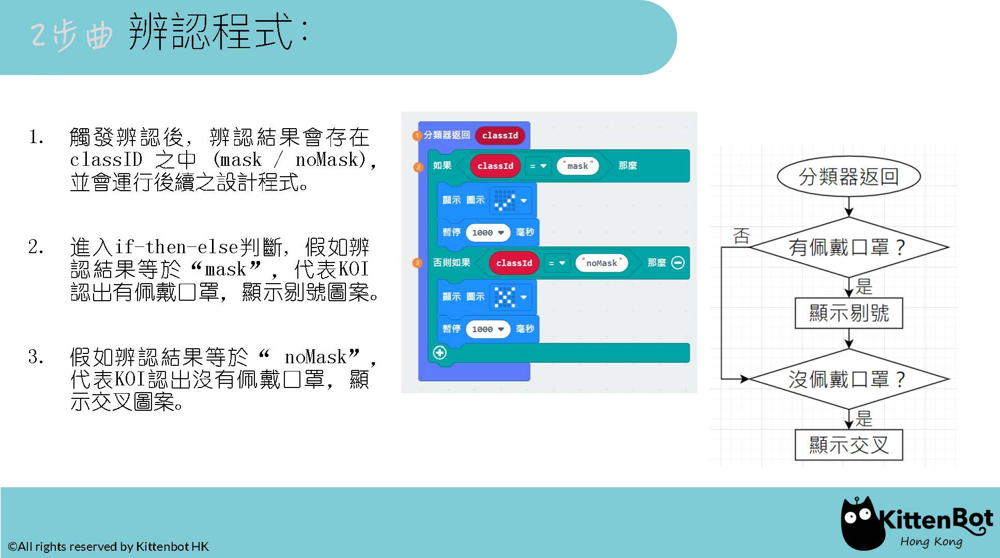

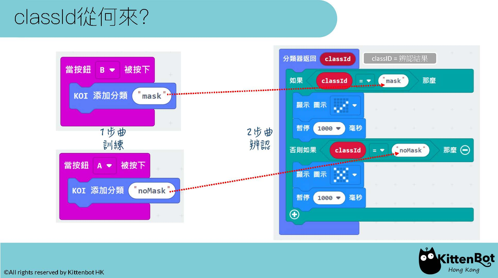

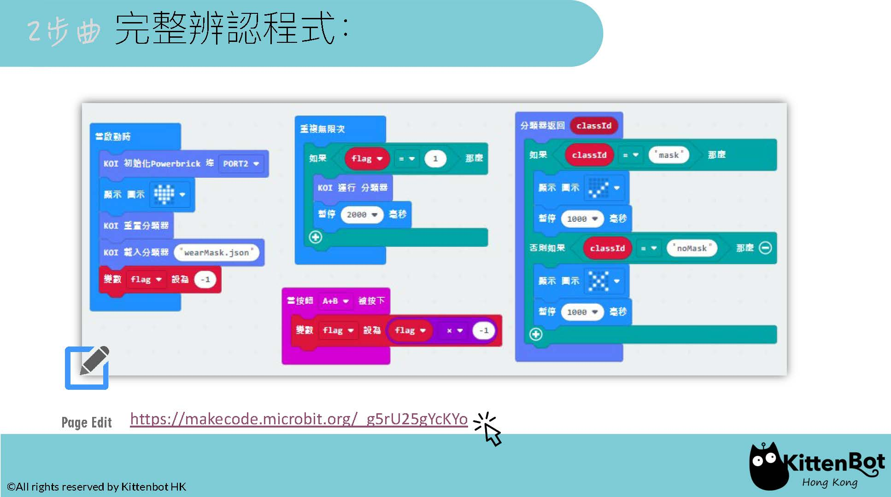

#### ****辨認參考程式:  [https://makecode.microbit.org/_g5rU25gYcKYo](https://makecode.microbit.org/_g5rU25gYcKYo) **

#### **辨認示範 Youtube: [https://youtu.be/Z4Ce5h6rGqs](https://youtu.be/Z4Ce5h6rGqs)**

