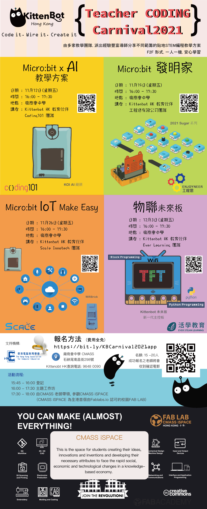

# Teacher Coding Carnival 2021

KittenBot HK在2021年11月至12月將會舉辦Teacher Coding Carnival 2021，邀請了不同教育機構的專業導師在連續四個星期舉辦編程工作坊向學界分享KittenBot的熱門產品的用法和貼地的應用案例。工作坊的內容圍繞創客，AI，IoT和Python編程等的熱門內容。

是次活動除了得到各教育機構的支持之外，KittenBot HK更加很榮幸地得到廠商會中學的支持，不但借出場地與電腦舉辦是次活動，更加會開放全港首間得到Fablabs.io認證的校園Fablab讓各位同工參觀。

特別鳴謝以下教學機構派出專業導師支持是次活動

[Coding 101 - Think, Make, Improve](https://www.facebook.com/coding101.hk/)

[Enjoyneer - 工程思](https://www.facebook.com/enjoyneerhk/)

[SCALE InnoTech 智方創科](https://www.facebook.com/scaleinnotech/)

[STEAM Learning](https://www.facebook.com/steamlearninghk/)

鳴謝廠商會中學支持是次活動

[廠商會中學](https://www.cmass.edu.hk/)

## 活動詳情

### 工作坊1: Micro:bit x AI 教學方案

- 日期: 11月12日
- 時間: 16:00-17:30
- 地點: 廠商會中學(石硤尾南昌街298號)
- 講者: Coding101

### 工作坊2: Micro:bit 發明家

- 日期: 11月19日
- 時間: 16:00-17:30
- 地點: 廠商會中學(石硤尾南昌街298號)
- 講者: 工程思

### 工作坊3: Micro:bit IoT Make Easy

- 日期: 11月26日
- 時間: 16:00-17:30
- 地點: 廠商會中學(石硤尾南昌街298號)
- 講者: SCALE InnoTech

### 工作坊4: 物聯未來板

- 日期: 12月3日
- 時間: 16:00-17:30
- 地點: 廠商會中學(石硤尾南昌街298號)
- 講者: Ever Learning
