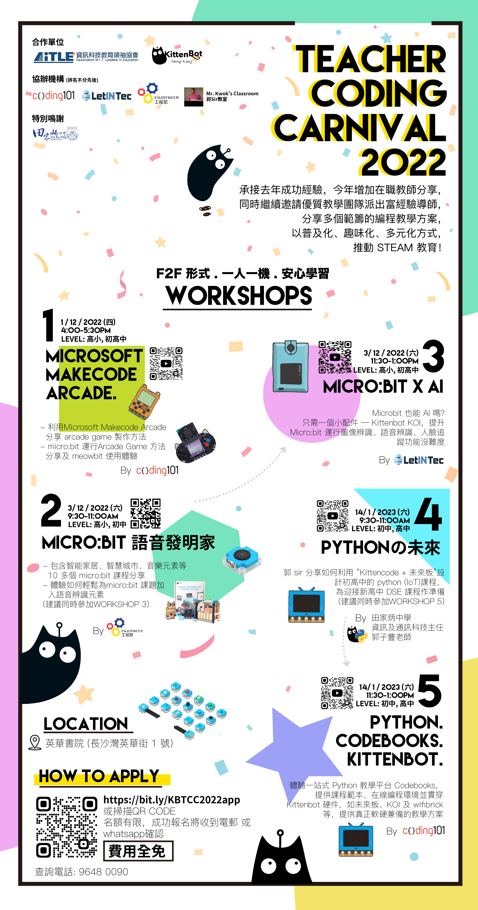

# Teacher Coding Carnival 2022

KittenBot HK在2022年12月至2023年1月將會與資訊科技教育領袖協會(AiTLE)共同舉辦Teacher Coding Carnival 2022，邀請了不同教育機構的專業導師舉辦編程工作坊向學界分享KittenBot的教學方案與貼地的應用案例。工作坊的內容圍繞創客，AI，遊戲設計和Python編程等的熱門內容。

特別鳴謝以下教學機構之專業導師/教師支持是次活動

[郭Sir教室 Mr. Kwok's Classroom](https://www.facebook.com/kwoksirclassroom)

[Coding 101 - Think, Make, Improve](https://www.facebook.com/coding101.hk/)

[Enjoyneer - 工程思](https://www.facebook.com/enjoyneerhk/)

[LetIN Technology](https://www.facebook.com/letintec/)

## 立即報名

## [報名表格](https://docs.google.com/forms/d/e/1FAIpQLSfArqQTTiLu8duHVkLoHdeP5x81k6a6l_RAIbFnhwlgNSUN_Q/viewform?usp=sf_link)

## 活動詳情

### 工作坊1: Microsoft Makecode Arcade 遊戲設計

工作坊簡介：

- 利用Microsoft Makecode Arcade 分享arcade game 製作方法。
- micro:bit 運行Arcade Game 方法分享及meowbit 使用體驗。

- 日期: 2022年12月1日
- 時間: 16:00-17:30
- 地點: 九龍深水埗英華街 1 號英華書院 C602 InnoLab
- 講者: Coding101

### 工作坊2: Micro:bit 語音發明家

工作坊簡介：

- 包含智能家居﹑智慧城巿﹑音樂元素等10多個micro:bit 課程分享。
- 親身體驗如何輕鬆讓micro:bit 課題加入語音辨識元素!

(建議同時參加Workshop 3)

- 日期: 2022年12月3日
- 時間: 09:30-11:00
- 地點: 九龍深水埗英華街 1 號英華書院 C602 InnoLab
- 講者: Enjoyneer

### 工作坊3: Micro:bit x AI

工作坊簡介：

Microbit 也能AI嘛? 
只需一個小配件 -- Kittenbot KOI, 提升Micro:bit 運行圖像辨識﹑語音辨識﹑人臉追蹤功能沒難度。

- 日期: 2022年12月3日
- 時間: 11:30-13:00
- 地點: 九龍深水埗英華街 1 號英華書院 C602 InnoLab
- 講者: LetIN Technology

### 工作坊4: Pythonの未來

工作坊簡介：

郭sir 分享如何利用未來板設計初高中的python 課程, 為迎接新高中DSE 課程作準備。

(建議同時參加Workshop 5)

- 日期: 2023年1月14日
- 時間: 09:30-11:00
- 地點: 九龍深水埗英華街 1 號英華書院 C602 InnoLab
- 講者: 田家炳中學 資訊及通訊科技主任 郭子豐老師

### 工作坊5: Python. Codebooks. Kittenbot.

工作坊簡介：

體驗一站式Python 教學平台Codebooks, 提供課程範本﹑在線編程環境並貫穿Kittenbot 硬件, 如未來板﹑KOI  及wifibrick 等, 提供真正軟硬兼備的教學方案。

- 日期: 2023年1月14日
- 時間: 11:30-13:00
- 地點: 英華小學
- 講者: Coding101