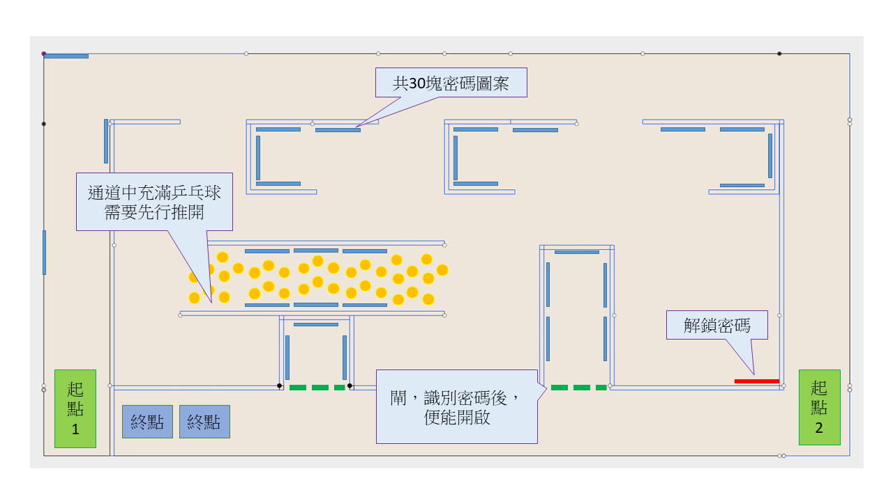

# 比賽細節與規則

## 注意事項：
1. 由於疫情關系，避免人群聚集，參賽隊伍切勿過早到達會場
2. 所有進入學校人士，必須掃描安心出行碼，或填寫健康申報表，以及測量體溫
3. 若進入預備區的時間仍未到達，請到地下有蓋操場等候
4. 準時到達預備區準備器材及作最後測試
5. 各隊參賽者之間，會設立擋板進行分隔，並預留足夠的空間，各位在場人士必須全程戴上口罩
6. 大會將安排清潔人員在場，在每隊參賽者完成賽事離開後，便會馬上清潔及消毒，才會讓另一隊繼續使用
7. 參賽隊伍在比賽後並確認了成績結果，請離開會場，避免人群聚集

## 場地：

1. 4 呎 x 8 呎 x 6 吋高 (2440mm x 1220mm x 150mm) 場地
2. 使用木板進行分隔
3. 場地地面，鋪上白色的防火膠板

## 密碼圖案咭：
1. 圖案不大於 4cm x 4cm
2. 使用雷射打印機在白紙上印出黑色圖案
3. 圖案貼在紙板上，再貼在場地的牆壁上

## 機械車：
1. 機械車必須使用 micro:bit 作主控系統
2. 並配合 KittenBot PowerBrick (Armourbit) 或 Robotbit 使用
3. 物件識別必須主要使用 KittenBot AI KOI 鏡頭
4. 機械車可配合搖控器運作，類型沒有限制，例如：另一塊 micro:bit、搖控手掣、電腦均可
5. 除 1-3 項指定設備外，參賽者可以運用任何材料、工具或技術改裝機械車
6. 機械車在行走及識別密碼時，不可損壞場地，及破壞密碼咭

## 比賽方法：
1. 參賽者最多 4 人一組
2. 每間學校最多派出 2 隊參賽
3. 同時最多使用 2 台機械車
4. 搖控器數量不限
5. 為避免互相干擾，大會在報名確認信中，會指派 4 個固定的無線通訊頻道編號(Group ID)給每組參賽隊伍，用作 micro:bit 之間的無線通訊使用，4 個編號用途是「搖控 1、搖控 2、答案展示、開啟閘門」
6. 在開始前，評判會先讓參賽者測試答案展示及開啟閘門功能
7. 參賽者將機械車放到場地上指定「起點」位置，開啟機械車後，便不可再接觸機械車
8. 之後使用搖控器控制機械車行走，盡快尋找不同的密碼咭，並進行識別
9. 限時最多 15 分鐘
10. 帶隊老師及同工只可在等候區觀賽，亦不可給參賽學生作出任何提示

## 解密方法：
1. 參賽者需要準備另一塊 micro:bit，放在比賽場地旁，用作顯示解密後的資料
2. 用作顯示資料的 micro:bit，在啟動，及比賽開始後，便不能觸碰，應透過無線控制顯示
3. 當 KOI 鏡頭識別到密碼後，將對應的英文字母顯示在顯示資料用的 micro:bit 上
4. 部份密碼咭放置在閘門後，參賽者需要先行使用 KOI 識別解鎖密碼後，並傳送「G」訊息到指定無線頻道，控制閘門開啟
5. 密碼是古代甲骨文文字

## 評分方法：
1. 參賽者需要尋找密碼咭，在識別到正確的密碼後，加 1 分
2. 當中有 6 張密碼咭藏於被乒乓球填滿的通道中
3. 參賽者需要控制機械車，推開/推散乒乓球後，再進入進行識別
4. 乒乓球通道內的每張密碼咭，成功正確識別後，加 2 分
5. 若識別了重複的密碼，並不會扣分
6. 以參賽隊伍的得分進行排名
7. 若遇同分，則以需要時間較短者，會獲得較高的排名

## 故障處理：
1. 若參賽者的機械車於中途出現故障，可以進行更換或維修
2. 參賽者必須於進行任何更換或維修動作前，舉手並叫出「Reset」，讓評判知悉
3. 並在得到評判准許後，才可進行更換或維修動作
4. 處理期間計時器並不會停止，亦不會獲得額外補時
5. 完成更換或維修後，機械車需要重新放在「起點」處，開始行進

## 獎項：

### 小學組：

- 冠軍(1名)
    - 大獎杯一座
    - 每位參賽學生一份獎牌+獎狀
    - 合辦機構贊助的禮物一份
- 亞軍(1名)
    - 中獎杯一座
    - 每位參賽學生一份獎牌+獎狀
    - 合辦機構贊助 的禮物一份
- 季軍(1名)
    - 小獎杯一座
    - 每位參賽學生一份獎牌+獎狀
    - 合辦機構贊助的禮物一份
- 優異獎(5名)
    - 水晶獎座一個
    - 每位參賽學生一張獎狀
- 參與證書(全部完成比賽的參加者)
    - 證書一張
    
### 中學組：

- 冠軍(1名)
    - 大獎杯一座
    - 每位參賽學生一份獎牌+獎狀
    - 合辦機構贊助的禮物一份
- 亞軍(1名)
    - 中獎杯一座
    - 每位參賽學生一份獎牌+獎狀
    - 合辦機構贊助 的禮物一份
- 季軍(1名)
    - 小獎杯一座
    - 每位參賽學生一份獎牌+獎狀
    - 合辦機構贊助的禮物一份
- 優異獎(5名)
    - 水晶獎座一個
    - 每位參賽學生一張獎狀
- 參與證書(全部完成比賽的參加者)
    - 證書一張