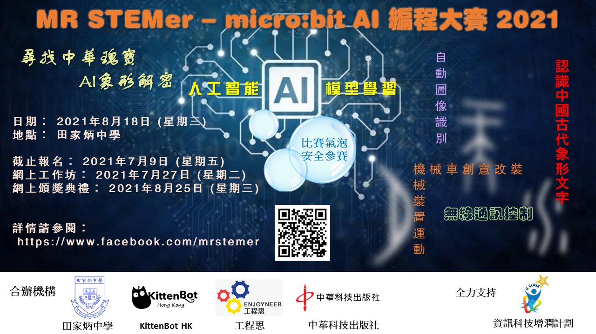

# MR STEMer - micro:bit AI編程大賽2021比賽內容

## 比賽主題:

### 尋找中華瑰寶 - AI 象形解密

透過使用遙控器控制搭載了Kittenbot KOI AI鏡頭的機械車，在比賽場地上尋找古代甲骨文密碼並使用機器學習模型識別出密碼內容。

## 比賽合辦機構:

### 田家炳中學
### KittenBot HK
### 工程思
### 中華科技出版社

## 全力支持:
### 資訊科技增潤計劃

---

## 比賽資料：

### 比賽日期： 2021 年 8 月 18 日 (星期三)

### 後備日期： 2021 年 8 月 20 日 (星期五) (若原訂日期無法進行，才會使用後備日期)

### 地點： 田家炳中學
###比賽區： N504 活動室
###預備區： RM506, RM507 課室
### 隊伍： 最多 20 隊
### 網上頒獎典禮： 2021 年 8 月 25 日 (星期三) 於 Zoom 平台進行，網上會議連結，將會個別通知得獎隊伍
### 獲獎名單將會在比賽大會網站及 Facebook 專頁上發佈
### 獎品： 會透過郵遞/快遞，寄送到獲獎學校
