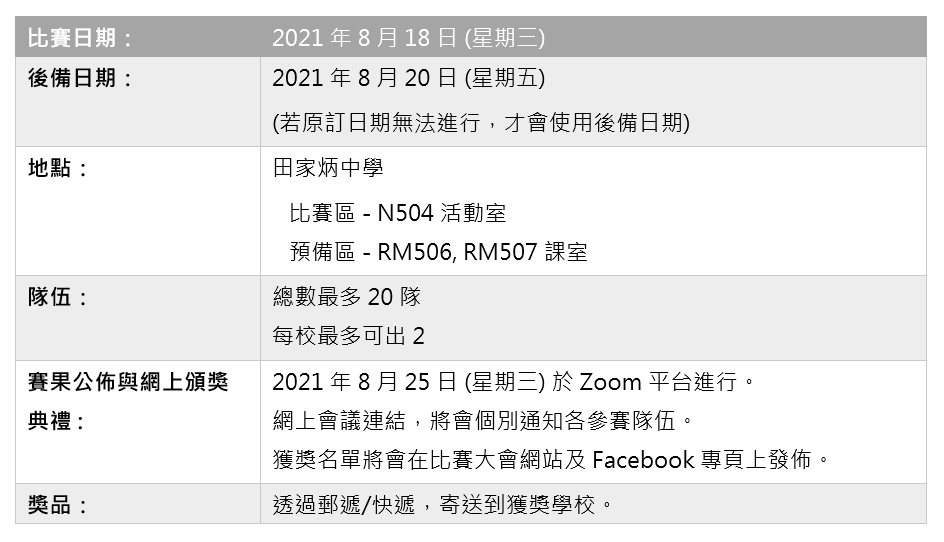

# MR STEMer - micro:bit AI編程大賽2021比賽介紹

## 比賽主題

### **尋找中華瑰寶 - AI 象形解密**

透過使用遙控器控制搭載了Kittenbot KOI AI鏡頭的機械車，在比賽場地上尋找古代甲骨文密碼並使用機器學習模型識別出密碼內容。

## 比賽合辦機構

#### ▹ 田家炳中學
#### ▹ KittenBot HK
#### ▹ 工程思教育有限公司
#### ▹ 中華科技出版社

### *全力支持 :*

#### ▸資訊科技增潤計劃

## 比賽資料

[田家炳中學地址](https://goo.gl/maps/XgsrNDeUQQdadzT66)

[詳細資料下載](https://bit.ly/3wvyPBo)

