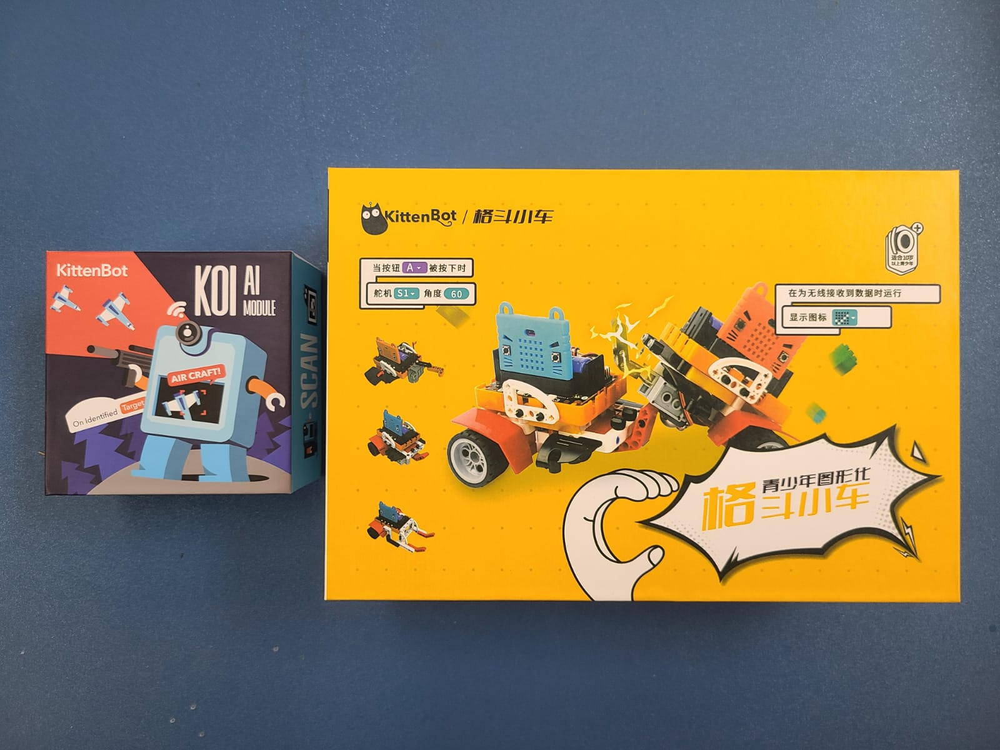
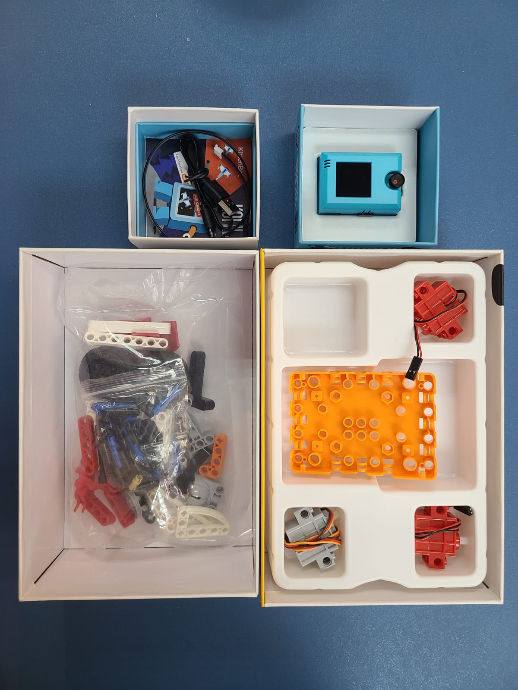

# 借用器材清單 (14/07/2021 更新)

### 🛠 借用器材資訊 

如已向比賽大會提交器材借用表格, 將會收到由合辦機構 Kittenbot HK 安排寄出的包裹1份, 包含:

1. Kittenbot 三合一機械車組件
2. Kittenbot KOI AI 鏡頭📷

詳細見下圖

##### Kittenbot [三合一機械車組件](https://kittenbothk.readthedocs.io/en/latest/Kits/3in1/intro.html)

1. 積木包 x1
2. 65mm 車輪 x2
3. GeekServo電機 x2
4. GeekServo舵機 x1
5. Robotbit 底座 x1

##### Kittenbot [KOI](https://kittenbothk.readthedocs.io/en/latest/AI%20Cam/index.html) AI 鏡頭📷

1. KOI AI 鏡頭 x1

2. USB 線 x1

3. 4芯轉dupont線 x1

   

### 📆 器材派送日期

包裹將於2021年**7月19-23日期間**, 由順豐速遞派送到申請表上所示的收件人及學校地址。

### ❗ 注意事項

- 為確保器材能有效的運用，若參賽隊伍在領取借用器材後，臨時取消參加比賽，必須盡快將器材歸還到田家炳中學

- 所有借用的器材，必須於比賽當日完成賽事後**還原並即時交還**田家炳中學

  

