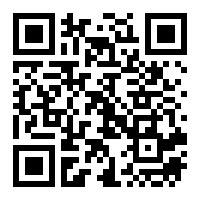

# 報名方法與示範教學

## 報名方法:

比賽經網上報名，比賽名額20隊，名額先到先得。

網上報名連結：<https://forms.gle/Mfnj3mgVJtQux4Tw7>

另外比賽大會將會提供設備借用服務，學校可以向大會借出MRSTEMer 3合1格鬥小車或KOI AI鏡頭，數量有限，先到先得。

-  三合一機械車組件 x 共 40 套 (每隊參賽者，最多借用 2 套)
-  Kittenbot AI 鏡頭 KOI x 共 40 套 (每隊參賽者，最多借用 2 套)
-  所有借用的器材，必須於比賽完成後，即時交還
-  為確保器材能有效的運用，若參賽隊伍在領取借用器材後，臨時取消參加比賽，必須盡快將器材歸還
-  需要借用器材的參賽隊伍，需要額外填寫「借用器材申請表」，並蓋上校印
- 「借用器材申請表」下載連結附於比賽網上報名表上
- 大會會發出確認電郵，並將借用器材寄送到參賽學校，或指定地址

## 網上工作坊：

參賽者成功報名後，大會將會安排 Zoom 網上工作坊，詳細講解比賽注意事項

## 示範影片：

- 比賽示範
  - <https://drive.google.com/file/d/12yls9Plnfm2feUMHXRcKA4Z4kadsZais/view?usp=drivesdk>
- 機械車組裝流程
- 搖控程式、打開閘門程式、發送解密訊息程式示範
- Kittenbot KOI AI 圖像識別模組應用
- KOI 與 Servo Motor 結合組裝示範

## AI 象形密碼咭圖樣

參賽隊伍需要使用KOI AI鏡頭的機器學習功能訓練模型並辨認象形密碼，比賽提供的象形密碼可以參考以下文件。

<https://drive.google.com/file/d/1Pz7Ac0pB41Xa7AbbVS-RkFYEz0bbnsa_/view?usp=sharing>