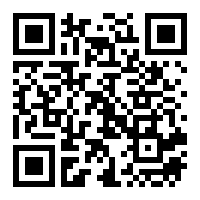

# 報名方法與器材借用

## 報名方法

比賽經網上報名，比賽名額20隊，名額先到先得。

📝網上報名連結：<https://forms.gle/Mfnj3mgVJtQux4Tw7>

## 器材

#### 🛠 示範器材

大會的比賽示範與解說中所用的器材清單 (參賽者以1組2車計算)

1. micro:bit x 5
2. Kittenbot robotbit 擴展板連鋰電池 x 4 (機械車與搖控)
3. Kittenbot 3合1格鬥小車套裝 x 2
4. Kittenbot KOI AI 鏡頭 x 2

#### 🛠 器材借用 

比賽大會將會提供設備借用服務，參賽學校可以向大會借用 **MRSTEMer 3合1格鬥小車或KOI AI鏡頭**，數量有限，先到先得。

[借用申請表格](https://drive.google.com/file/d/1xuXTS5QbojLXxSka37UOhgUVmsVEtEz1/view?usp=sharing)

-  Kittenbot 三合一機械車組件🏎 x 共 40 套 (每隊參賽者，最多借用 2 套)
-  Kittenbot KOI AI 鏡頭📷 x 共 40 套 (每隊參賽者，最多借用 2 套)
-  借用之器材 **不包含擴展板 [Robotbit](https://kittenbothk.readthedocs.io/en/latest/Microbit_eboard/Robotbit/index.html)  / [Armourbit](https://kittenbothk.readthedocs.io/en/latest/functional_module/PWmodules/Armourbit.html)**, 參賽隊伍須**自行準備** / 向Kittenbot HK 訂購 [Whatsapp96480090](https://api.whatsapp.com/send?phone=85296480090&text=你好,我校參加了MRSTEMer2021比賽,需要訂購Robotbit/Armourbit)
-  所有借用的器材，必須於比賽當日完成賽事後，即時交還
-  為確保器材能有效的運用，若參賽隊伍在領取借用器材後，臨時取消參加比賽，必須盡快將器材歸還到田家炳中學
-  需要借用器材的參賽隊伍，需要額外填寫「借用器材申請表」，並蓋上校印
- 「借用器材申請表」下載連結附於比賽網上報名表上
- 大會會發出確認電郵，並將借用器材寄送到參賽學校，或指定地址

