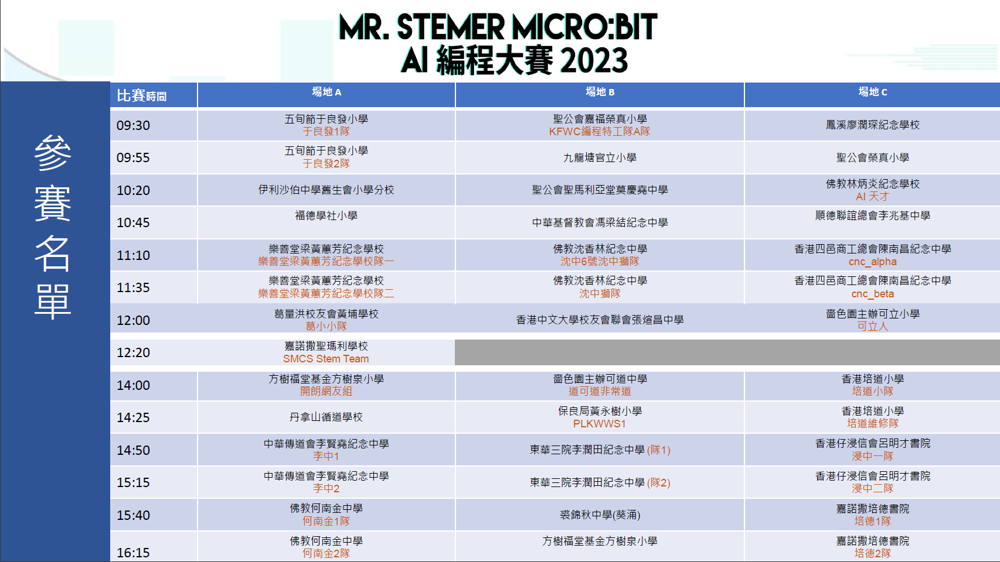

# 比賽安排

2023 MR STEMer micro:bit編程比賽現已停止接受報名，感謝各位同工和同學的熱烈報名。

下列是當日賽事的安排，請各位參賽者細閱。

## 參賽名單與比賽時間

以下是各隊的比賽時間，敬請各參賽隊伍準時出席。

[下載PDF](https://drive.google.com/file/d/1B0aqMLT81MEHzB99oRW-pssWXCW3hf92/view?usp=sharing)

## 頻道參照表

以下為當日比賽各隊伍所獲分派的頻道，請確保比賽設備已設定到正確的頻道。

為確保比賽的順利舉行及避免頻道相撞，各參賽隊伍**必須**使用獲編排的頻道進行比賽。

[下載PDF](https://drive.google.com/file/d/1pF0xlpjwtwhF6SYPgivE1g6hbDSvgQC0/view?usp=sharing)
