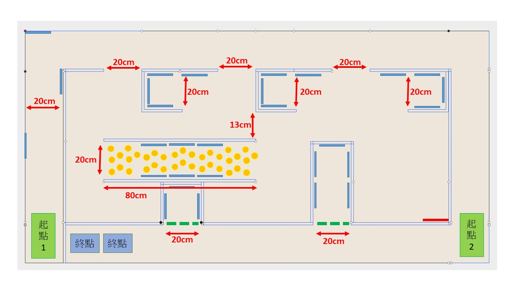
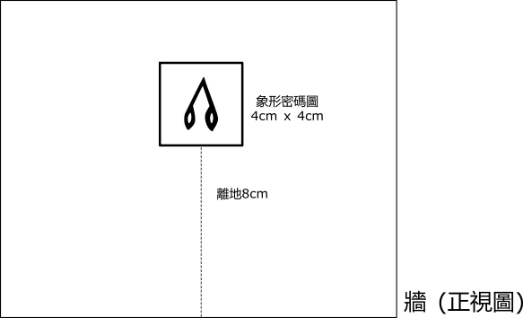
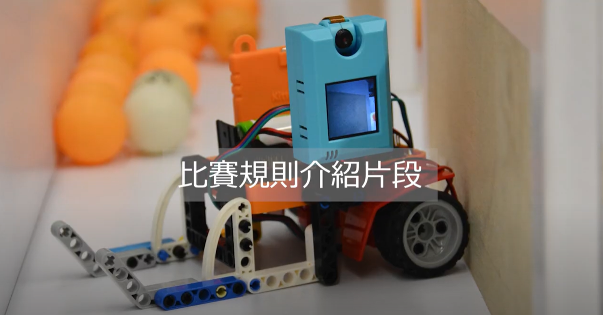

# 比賽細節與規則

### ⚠重要事項：

1. 由於疫情關系，避免人群聚集，參賽隊伍切勿過早到達會場

2. 準時到達預備區準備器材及作最後測試

3. 參賽隊伍在比賽後並確認了成績結果，請離開會場，避免人群聚集

## 賽事場地

1. 4 呎 x 8 呎 x 6 吋高 (2440mm x 1220mm x 150mm) 場地
2. 使用木板進行分隔
3. 場地地面，鋪上白色的防火膠板
4. 除乒乓通道旁的一條為特窄通道(13cm) 外, 其餘通道的闊度為20cm

## 象形密碼圖案咭規格

1. 圖案不大於 4cm x 4cm
2. 使用雷射打印機在白紙上印出黑色圖案
3. 圖案貼在紙板上，再貼在場地的牆壁上
4. 圖案底部離地8cm

## 機械車規格

1. 機械車必須使用 **micro:bit**作主控系統
2. 並配合 KittenBot **擴展板 [Armourbit](https://kittenbothk.readthedocs.io/en/latest/functional_module/PWmodules/Armourbit.html)  或 [Robotbit](https://kittenbothk.readthedocs.io/en/latest/Microbit_eboard/Robotbit/Robotbitfull.html)** 使用
3. 物件識別必須主要使用**KittenBot [KOI](https://kittenbothk.readthedocs.io/en/latest/AI%20Cam/index.html) AI 鏡頭** 
4. 機械車可配合搖控器運作，類型沒有限制，例如：另一塊 micro:bit、搖控手掣、電腦均可
5. 除 1-3 項指定設備外，參賽者可以運用任何材料、工具或技術改裝機械車
6. 機械車在行走及識別密碼時，不可損壞場地及破壞密碼咭

## 比賽編制

1. 每間學校最多派出 2 隊參賽
2. 每隊最多可以 4 位參賽者組
3. 每隊最多使用 2 台機械車同時作賽
4. 搖控器數量不限
5. 為避免互相干擾，大會在報名確認信中，會指派 **4 個**  固定的無線通訊頻道編號(Group ID)給每組參賽隊伍，用作 micro:bit 之間的無線通訊使用。 建議4 個無線編號分別是編派到**「搖控 1、搖控 2、解密展示、開啟閘門」**與主車的連線
6. 在開始前，評判會先讓參賽者**測試**解密展示及開啟閘門功能
7. 參賽者將機械車放到場地上指定「起點」位置，開啟機械車後，便不可再接觸機械車
8. 之後使用搖控器控制機械車行走，盡快尋找不同的密碼咭，並進行識別解密
9. 每場賽事限時 15 分鐘
10. 帶隊老師及同工須於等候區觀賽，不可給參賽學生作出任何提示

## 平衡機制介紹

為創造公平環境, 同時鼓勵更多同學從活動中學習，大會於本屆賽事中新增平衡機制。

平衡機制只對參賽隊員名單中, 有曾經參加過MR STEMer micro:bit AI編程大賽2021的選手有效, 簡稱”再賽選手”。

如有本屈參賽隊伍中有再賽選手，請帶隊老師於報名表格中提供資料。

### 平衡機制說明

假如隊伍裡面有再賽選手，隊伍的”完成時間”將被加時。

完成時間 = 實際時間 + 再賽選手人數 x 1min

### 例子1: 
- 假如隊伍A中有4名再賽選手，該隊伍最後於10mins完成掃描所有密碼卡並獲得滿分。
- 由於隊伍有4名再賽選手，隊伍的完成時間 = 10mins (實際時間) +  4 x 1min= 14mins。
- A隊伍的最終分數為36分，完成時間為14分鐘。

### 例子2:
- 假如隊伍B中有2名再賽選手以及2名初次參賽選手，該隊伍在15mins限時完結時獲得30分。
- 由於隊伍有2名再賽選手，隊伍的完成時間 = 15mins+ 2 x 1min = 17mins。
- 隊伍的最終分數為30分，所需時間為17mins。

小貼士:  再賽選手可作為隊中顧問, 以舊帶新把經驗傳承, 亦有助校園STEAM 長遠發展。

## 命名解說

micro:bit (主車) - 機械車上的micro:bit

micro:bit (搖控) - 搖控機械車用的micro:bit

micro:bit (閘門) - 控制封鎖通道前大閘的micro:bit

micro:bit (顯示) - 顯示解密字母用的micro:bit

## 解密方法

選手通過micro:bit (搖控), 無線控制已裝有KOI AI 鏡頭的機械車的移動。

機械車走到象形圖前並調較合適位置, 讓車上的KOI AI 鏡頭能對準象形圖並進行辨識。

辨識結果由microbit(主車) , 通過無線訊號傳送到micro:bit (顯示)上並顯示解密字母。

**細節:**

1. 除micro:bit (主車) 及micro:bit (搖控) , 參賽隊伍需要準備另一塊 micro:bit (顯示) ，放在比賽場地指定位置，用作顯示解密後的英文字母。

2. 賽事一旦開始, 選手便不能再次觸碰microbit(顯示)。microbit(顯示)只能透過無線接收訊號及顯示解密字母。

3. 當機械車上的 KOI AI 鏡頭識別到象形圖後，車上的micro:bit (主車)需通過無線訊號把結果傳送到microbit(顯示), 並把對應的英文字母顯示在microbit(顯示)上。

4. 部份密碼咭放置在micro:bit (閘門) 所控制的閘門後的封鎖通道，參賽者需要先行使用 KOI 識別指定**解鎖象形圖**，並通過相關的無線頻道傳送「G」訊息到microbit (閘門)，便能成功開啟閘門進入封鎖通道。

   

## 短片示範

為讓各參賽者更清楚了解比賽玩法, 大會特意製作短片介紹

🎥 <https://youtu.be/gUcXjmxuQjg>

## 評分方法

1. 參賽者需要尋找密碼咭，在識別到正確的密碼後，加 1 分
2. 當中有 6 張密碼咭藏於被乒乓球填滿的通道中, 參賽者需要控制機械車，推開/推散乒乓球從而進入通道進行識別
4. 乒乓球通道內的每張密碼咭，成功正確識別後，加 2 分
5. 若重複識別已得分密碼，不再加分亦不會扣分
6. 以參賽隊伍的總得分進行排名
7. 若遇同分，則以需要時間較短者，會獲得較高的排名

## 故障處理

1. 若參賽者的機械車於中途出現故障，可以進行更換或維修
2. 參賽者必須於進行任何更換或維修動作前，舉手並叫出「Reset」，讓評判知悉, 並在得到評判准許後，才可進行更換或維修動作
4. 處理期間計時器並不會停止，亦不會獲得額外補時
5. 完成更換或維修後程序，機械車需要重新放在「起點」處繼續作賽
