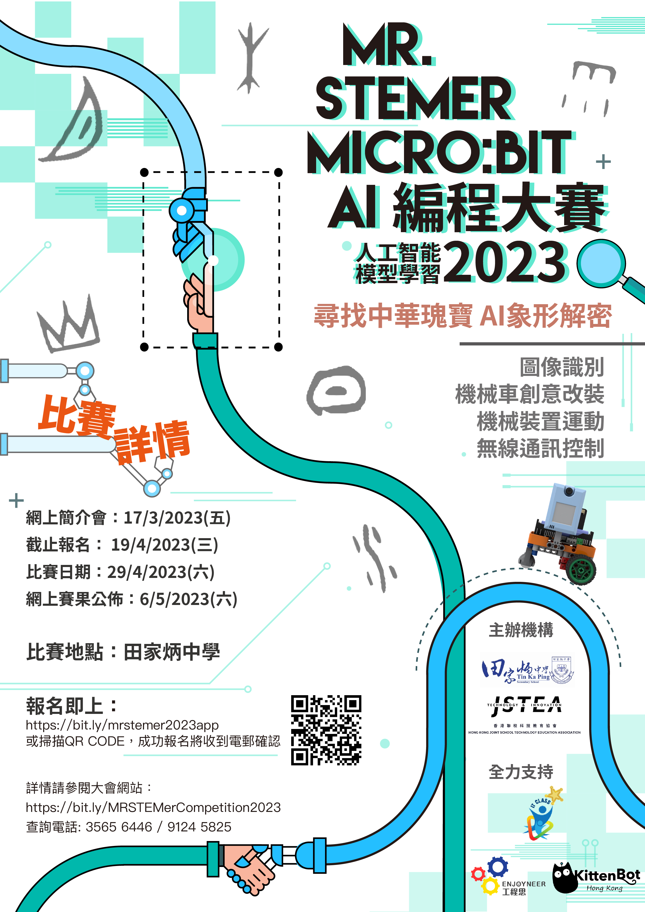
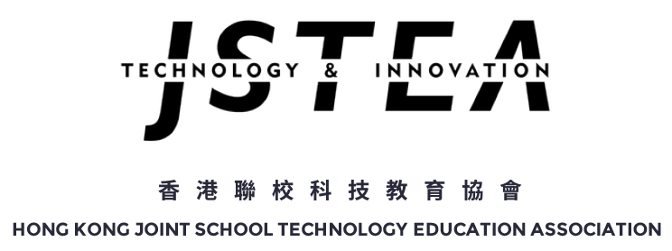
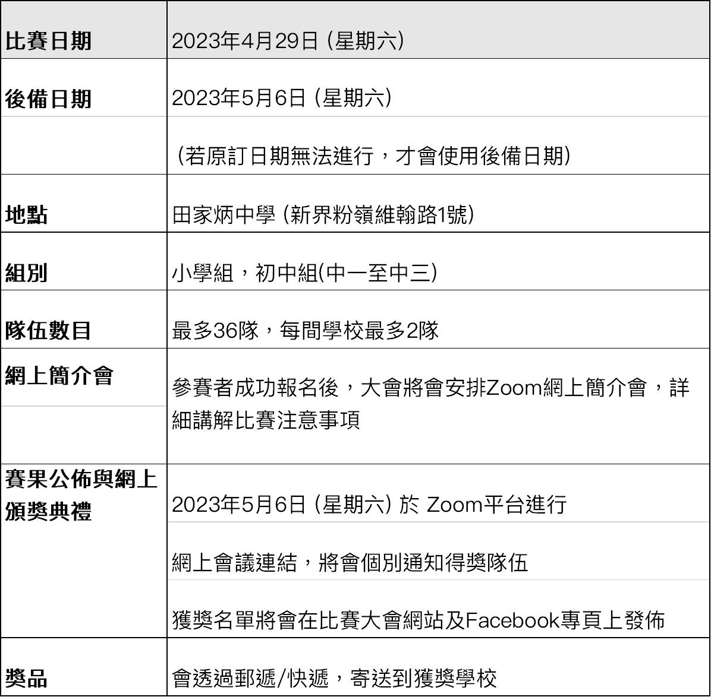
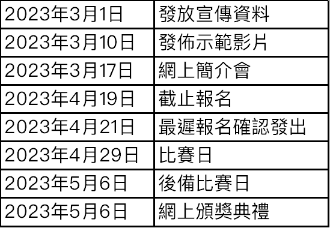

# MR STEMer - micro:bit AI編程大賽2023比賽介紹

## 主題

### **尋找中華瑰寶 - AI 象形解密**

透過使用遙控器控制搭載了Kittenbot KOI AI鏡頭的機械車，在比賽場地上尋找古代甲骨文密碼並使用機器學習模型識別出密碼內容。

## 合辦機構

#### ▹ 田家炳中學

#### ▹ Enjoyneer 工程思教育有限公司

#### ▹ 香港聯校科技教育協會

#### ▹ KittenBot HK

#### 

### *全力支持 :*

#### ▸資訊科技增潤計劃

## 比賽資料

[比賽大會網站](https://bit.ly/MRSTEMerCompetition2023)

[Facebook專頁](https://www.facebook.com/mrstemer)

[田家炳中學地址](https://goo.gl/maps/XgsrNDeUQQdadzT66)

[詳細資料下載](https://bit.ly/3wvyPBo)

#### 

## 注意事項：

1.	由於疫情關系，避免人群聚集，參賽隊伍切勿過早到達會場
2.	準時到達預備區準備器材及作最後測試
3.	參賽隊伍在比賽後並確認了成績結果，請離開會場，避免人群聚集

## 重要日程 

📌日程會按需要有所更改, 請留意比賽的Facebook [專頁](https://www.facebook.com/mrstemer)

## 場次安排

