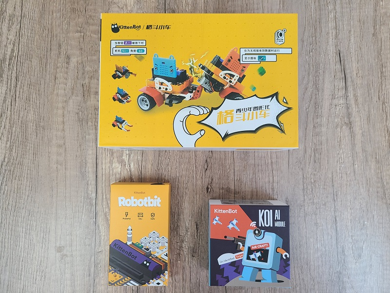
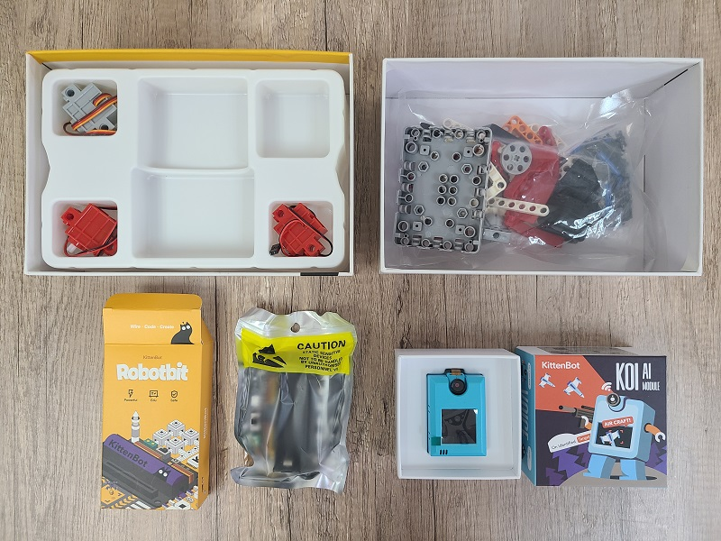
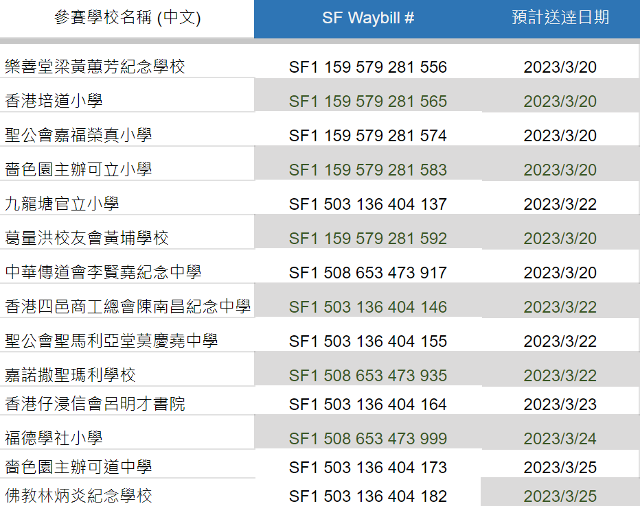
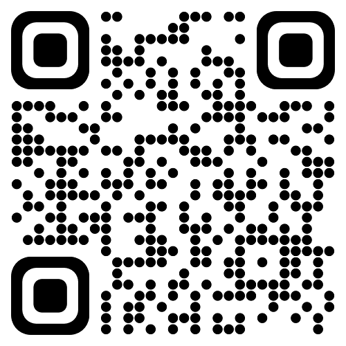

# 借用器材清單 (16/3/2023更新)

### 🛠 借用器材資訊 

如已向比賽大會提交器材借用表格, 將會收到由合辦機構 Kittenbot HK 安排寄出的器材套件包裹:

1. Kittenbot 三合一機械車組件
2. Kittenbot Robotbit 2.2 擴展板連電池
3. Kittenbot KOI AI 鏡頭📷

詳細見下圖

##### 1. Kittenbot [三合一機械車組件](https://kittenbothk.readthedocs.io/en/latest/Kits/3in1/intro.html)

1. 積木包 x1
2. 65mm 車輪 x2
3. GeekServo電機 x2
4. GeekServo舵機 x1
5. Robotbit 底座 x1

##### 2. Kittenbot [Robotbit 擴展板](https://kittenbothk.readthedocs.io/en/latest/Microbit_eboard/Robotbit/index.html)

1. Kittenbot Robotbit 擴展板連電池

##### 3. Kittenbot [KOI](https://kittenbothk.readthedocs.io/en/latest/AI%20Cam/index.html) AI 鏡頭📷

1. KOI AI 鏡頭 x1

2. USB 線 x1

3. 4芯轉dupont線 x1
   
##### 器材數量會按照早前大會收到的「借用器才申請表」內容分發到各參賽學校

### 📆 器材派送日期

第一批包裹將於2023年3月17日寄出, 由順豐速遞派送到申請表上所示的收件人及學校地址。

以下為各隊伍包裹之速遞單編號

各隊伍負責老師收到器才包裹點算數量無誤後, 請點撃連結[**確應收妥**](https://forms.gle/JLqgzqJpfXxtGfwW8)。謝謝合作!

### ❗ 注意事項

- 為確保器材能有效的運用，若參賽隊伍在領取借用器材後，臨時取消參加比賽，必須盡快將器材歸還到田家炳中學

- 所有借用的器材，必須於比賽當日完成賽事後**還原並即時交還**田家炳中學