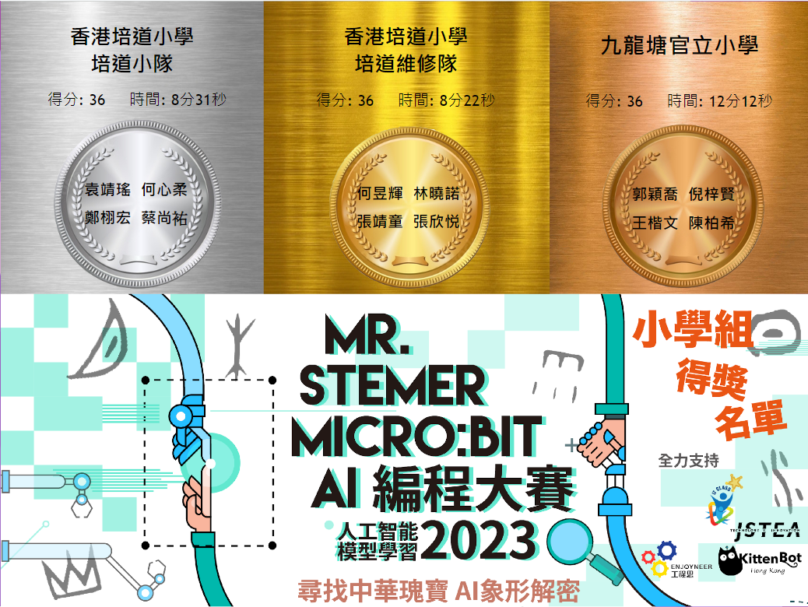
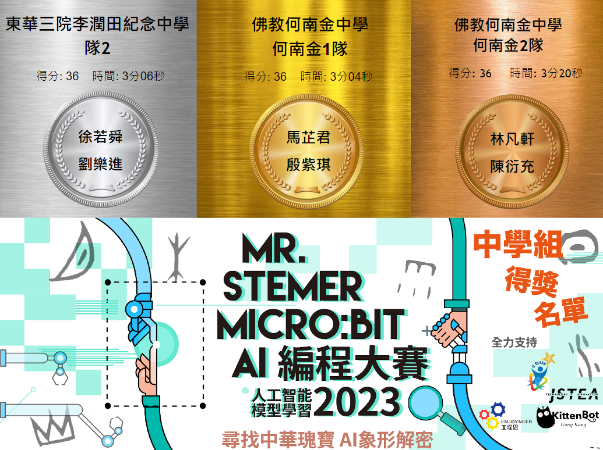

# 得獎名單

## 小學組三甲

### 冠軍: 香港培道小學-培道維修隊

### 亞軍: 香港培道小學-培道小隊

### 季軍: 九龍塘官立小學

## 中學組三甲

### 冠軍: 佛教何南金中學-何南金1隊

### 亞軍: 佛教何南金中學-何南金2隊

### 季軍: 東華三院李潤田紀念中學-隊2

## 小學組優異獎

### 五旬節于良發小學 (于良發2隊)
### 保良局黃永樹小學 (PLKWWS1)
### 聖公會榮真小學
### 樂善堂梁黃蕙芳紀念學校 (樂善堂梁黃蕙芳紀念學校隊二)
### 葛量洪校友會黃埔學校 (葛小小隊)

## 中學組優異獎

### 東華三院李潤田紀念中學(隊1)
### 中華傳道會李賢堯紀念中學(李中2)
### 嘉諾撒培德書院(培德1隊)
### 香港四邑商工總會陳南昌紀念中學(cnc_alpha)
### 香港四邑商工總會陳南昌紀念中學(cnc_beta)

